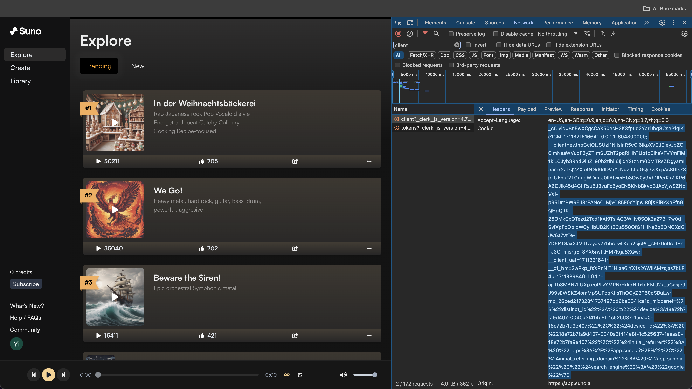

# Suno API

[![GitHub][github_badge]][github_link] [![PyPI][pypi_badge]][pypi_link]

Unofficial Suno Python API


## Installation

```bash
pip install suno-api
```


## Quickstart

### Sign in to Suno at https://app.suno.ai/, and get your cookie

You can find your cookie from the browser's Developer Tools -> Network tab




### Create an instance of class `Suno` with your cookie

```python
import suno

client = suno.Suno(cookie="your-cookie-here")
```


### Create your clips

```python
clips = client.songs.generate(
    "your-song-description-here", 
    instrumental=False,
)
```

or start with custom mode


```python
clips = client.songs.generate(
    "your-lyrics-here", 
    cutomized=True,
    tags="your-music-style-here",
    instrumental=False,
)
```


### Review the newly created clip.

```python
clip = client.songs.get("your-clip-id-here")
```


### Review all your created clips in the library.

```python
clips = client.songs.list()
```


### Check your remaining credits

```python
credits = client.get_credits()
```


### Here is a sample clip/song JSON object:

```json
{
  "id":"0e42f167-17ab-4004-941b-d549b24dce76",
  "video_url":"https://cdn1.suno.ai/0e42f167-17ab-4004-941b-d549b24dce76.mp4",
  "audio_url":"https://cdn1.suno.ai/0e42f167-17ab-4004-941b-d549b24dce76.mp3",
  "image_url":"https://cdn1.suno.ai/image_75b03116-0aa2-4367-bdf6-8556dde4df9f.png",
  "image_large_url":"https://cdn1.suno.ai/image_large_75b03116-0aa2-4367-bdf6-8556dde4df9f.png",
  "major_model_version":"v3",
  "model_name":"chirp-v3",
  "metadata":{
    "tags":"Rap\nJapanese rock\nPop\nVocaloid style\nEnergetic\nUpbeat\nCatchy\nCulinary\nCooking\nRecipe-focused",
    "prompt":"[Chorus]\nIn der Weihnachtsbäckerei\nGibt es manche Leckerei\nZwischen Mehl und Milch\nMacht so mancher Knilch\nEine riesengroße Kleckerei\nIn der Weihnachtsbäckerei\nIn der Weihnachtsbäckerei\n\n[Verse 1]\nWo ist das Rezept geblieben\nVon den Plätzchen, die wir lieben?\nWer hat das Rezept verschleppt?\n\"Ich nicht\"\n\"Du vielleicht?\"\n\"Ich auch nicht\"\n\nNa, dann müssen wir es packen\nEinfach frei nach Schnauze backen\nSchmeißt den Ofen an (oh ja)\nUnd ran\n\n[Chorus]\nIn der Weihnachtsbäckerei\nGibt es manche Leckerei\nZwischen Mehl und Milch\nMacht so mancher Knilch\nEine riesengroße Kleckerei\nIn der Weihnachtsbäckerei\nIn der Weihnachtsbäckerei\n\n[Verse 2]\nBrauchen wir nicht Schokolade\nHonig, Nüsse und Succade\nUnd ein bischen Zimt?\nDas stimmt\n\nButter, Mehl und Milch verrühren\nZwischendurch einmal probieren\nUnd dann kommt das Ei (pass auf)\nVorbei\n\n[Chorus]\nIn der Weihnachtsbäckerei\nGibt es manche Leckerei\nZwischen Mehl und Milch\nMacht so mancher Knilch\nEine riesengroße Kleckerei\nIn der Weihnachtsbäckerei\nIn der Weihnachtsbäckerei\n\n[Verse 3]\nBitte mal zur Seite treten\nDenn wir brauchen Platz zum kneten\nSind die Finger rein?\nDu Schwein\n\n\nSind die Plätzchen, die wir stechen\nErstmal auf den Ofenblechen\nWarten wir gespannt\nVerbrannt\n\n[Chorus]\nIn der Weihnachtsbäckerei\nGibt es manche Leckerei\nZwischen Mehl und Milch\nMacht so mancher Knilch\nEine riesengroße Kleckerei\nIn der Weihnachtsbäckerei\nIn der Weihnachtsbäckerei\n\n[Outro]",
    "gpt_description_prompt":"None",
    "audio_prompt_id":"None",
    "history":"None",
    "concat_history":[
      {
        "id":"7b9cfa43-d231-44e8-b69a-d9c0627b016d",
        "continue_at":107.0
      },
      {
        "id":"75b03116-0aa2-4367-bdf6-8556dde4df9f",
        "continue_at":"None"
      }
    ],
    "type":"concat",
    "duration":158.83997916666667,
    "refund_credits":"None",
    "stream":"None",
    "error_type":"None",
    "error_message":"None"
  },
  "is_liked":false,
  "user_id":"cb7486d0-238e-409e-9ff9-e69db325fa84",
  "is_trashed":false,
  "reaction":"None",
  "created_at":"2024-03-24T13:46:25.916Z",
  "status":"complete",
  "title":"In der Weihnachtsbäckerei ",
  "play_count":0,
  "upvote_count":724,
  "is_public":true
}
```


## License

Suno API has a BSD-3-Clause license, as found in the [LICENSE](https://github.com/imyizhang/suno-api/blob/main/LICENSE) file.


## Contributing


## Changelog

25.04.2024: Initial release


[github_badge]: https://badgen.net/badge/icon/GitHub?icon=github&color=black&label
[github_link]: https://github.com/imyizhang/suno-api


[pypi_badge]: https://badgen.net/pypi/v/suno-api?icon=pypi&color=black&label
[pypi_link]: https://www.pypi.org/project/suno-api